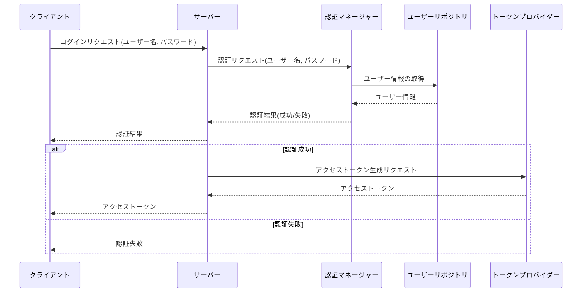

```mermaid
sequenceDiagram
    participant Client as クライアント
    participant Server as サーバー
    participant AuthenticationManager as 認証マネージャー
    participant UserRepository as ユーザーリポジトリ
    participant TokenProvider as トークンプロバイダー
    
    Client->>Server: ログインリクエスト(ユーザー名, パスワード)
    Server->>AuthenticationManager: 認証リクエスト(ユーザー名, パスワード)
    AuthenticationManager->>UserRepository: ユーザー情報の取得
    UserRepository-->>AuthenticationManager: ユーザー情報
    AuthenticationManager-->>Server: 認証結果(成功/失敗)
    Server-->>Client: 認証結果
    
    alt 認証成功
        Server->>TokenProvider: アクセストークン生成リクエスト
        TokenProvider-->>Server: アクセストークン
        Server-->>Client: アクセストークン
    else 認証失敗
        Server-->>Client: 認証失敗
    end

```
